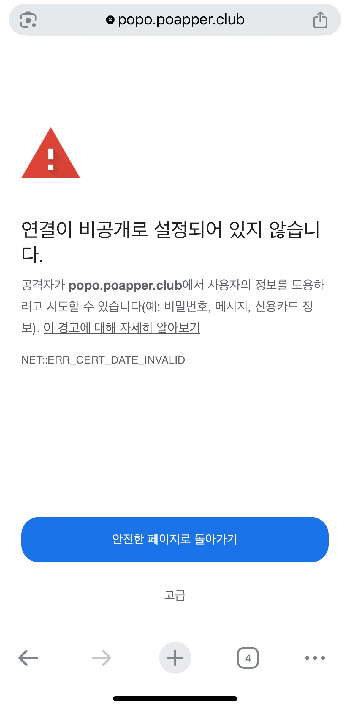

# cronjob 등록 시 유의사항(PATH)

<p align="center">
    
</p>

## 요약
1. cron이 실행될 때, 사용하는 PATH 환경변수는 매우 축소되어 있음
2. 그러니 cron이 실행할 바이너리를 잘 찾게끔 PATH를 설정해 줘야 함
3. `PATH=/usr/bin:/bin:/usr/sbin:/sbin:/usr/local/bin`

---

## 문제 상황
교내 개발동아리에서 유지보수 하고있는 [POPO](https://popo.poapper.club)는 [let's encrypt](https://letsencrypt.org/)와 [certbot](https://certbot.eff.org/)을 이용해 https 인증서를 관리하고 있다.

한 번 발급받으면 90일 정도 유지되고 유효기간이 30일 이내로 남았을 때 재발급이 가능하다. 기존에는 원격 EC2 머신에 들어가서 `certbot renew`를 수동으로 해주고 있었다. 까먹고 있다가 유효기간이 만료되면 사이트 접속이 안되는 사고가 난다.

<p align="center">
    
</p>

## certbot renew cronjob 등록 
인간 오류가 생기기 쉬운 번거로운 작업을 방지하고자 머신에 `cronjob`을 등록했다. 

```sh
$ sudo crontab -e

0 */12 * * * /usr/local/bin/certbot renew -q --deploy-hook "/usr/bin/systemctl reload nginx" >> /var/log/certbot-cron.log 2>&1  
```

이후 `--dry-run` 옵션으로 시뮬레이션 했을 때도 잘 되길래 맘놓고 있었다.
```sh
$ certbot renew --dry-run
# 대충 성공
```

## 다시 오류
...  
그런데.. 이상하게 재발급이 안 됐다.

<p align="center">
    
</p>

이번엔 머신에 접속 가능한 사람이 당장 없었고, 심지어 낮 시간이라 꽤나 큰 문제였다. 저녁 시간쯤 되어 해결되었지만, 대체 왜 자동 재발급이 안됐는지 알 수가 없었다.


## 원인 분석
로그를 찾아봤다. renew 과정에서 nginx를 못 찾는다고 한다.
```sh
$ cat /var/log/certbot-cron.log
Failed to renew certificate api.paxi.popo-dev.poapper.club with error: The nginx plugin is not working; there may be problems with your existing configuration.
The error was: NoInstallationError("Could not find a usable 'nginx' binary. Ensure nginx exists, the binary is executable, and your PATH is set correctly.")
All renewals failed. The following certificates could not be renewed:
  /etc/letsencrypt/live/api.paxi.popo-dev.poapper.club/fullchain.pem (failure)
1 renew failure(s), 0 parse failure(s)
```

흠.. 뭔가 내부적으로 nginx 를 사용하고 있는 것 같다. 우린 nginx로 도메인 관리를 하기 때문에 내부적으로 certbot의 nginx 플러그인을 사용하고, 이게 nginx를 호출한 것 같다. 터미널에서 renew 했을 때는 잘 되는데 왜 cron 상에서는 안될까?

답은 cron의 환경변수가 일반 유저와 다르기 때문이었다. cron은 일반 유저의 PATH 값을 상속하지 않는다. 대신, 그 값이 [cron에는 매우 제한적으로 설정](https://serverfault.com/questions/337631/crontab-execution-doesnt-have-the-same-environment-variables-as-executing-user)되어 있어서 nginx binary를 찾지 못하고 실패했던 것이다. certbot과 systemctl은 binary 위치를 명시해 주었지만, renew 과정 내부에서 nginx를 사용하는데 이 때는 binary 경로가 명시되어있지 않아서 찾지 못하는 문제였던 것이다. 로컬에서는 PATH가 잘 설정되어 있어 nginx를 정상적으로 부를 수 있었다.

## 해결
crontab에 PATH를 추가했다.
```sh
$ which nginx
/usr/sbin/nginx

$ sudo crontab -l
PATH=/usr/local/sbin:/usr/local/bin:/usr/sbin:/usr/bin:/sbin:/bin

0 */12 * * * /usr/local/bin/certbot renew -q --deploy-hook "/usr/bin/systemctl reload nginx" >> /var/log/certbot-cron.log 2>&1
```

다음날에 인증서가 정상적으로 재발급 되어있는 것을 확인할 수 있었다. 이제 인증서 걱정 없이 발뻗고 잘 수 있게 되었다.

---

## 그렇다면 cron의 기본 PATH는 뭘까
nginx의 바이너리 경로는 `/usr/sbin` 으로 `/usr/local/sbin`까지 갈 필요도 없었다. cron의 기본 PATH로 `/usr/sbin`도 설정되어 있지 않았다면, 대체 뭐가 설정되어 있는 것일까. 그래서 확인해봤다.

세팅한 PATH 지우고 환경변수 출력하게 했다.
```sh
$ sudo crontab -l

* * * * * env > /tmp/cron_env.txt
```

결과를 보니 정말 PATH에 `/usr/sbin`이 없었다. 참고로 Amazon Linux 2 머신이다.
```sh
$ cat /tmp/cron_env.txt 
XDG_SESSION_ID=414146
SHELL=/bin/sh
USER=root
PATH=/usr/bin:/bin
PWD=/root
LANG=en_US.UTF-8
SHLVL=1
HOME=/root
LOGNAME=root
XDG_RUNTIME_DIR=/run/user/0
_=/usr/bin/env
```

### `/sbin`, `/bin`의 차이
둘 다 바이너리 폴더이다.  
s는 superuser로, 주로 시스템 관리자(=root)가 실행하는 바이너리가 있다. 그러나 권한만 된다면 일반 유저도 `/sbin`에 위치한 바이너리를 실행할 수 있다.  `/usr/sbin`, `/usr/bin` 도 같은 맥락.  

[참고: Differences between /bin, /sbin, /usr/bin, /usr/sbin, /usr/local/bin, /usr/local/sbin](https://askubuntu.com/questions/308045/differences-between-bin-sbin-usr-bin-usr-sbin-usr-local-bin-usr-local)