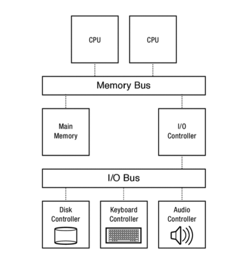
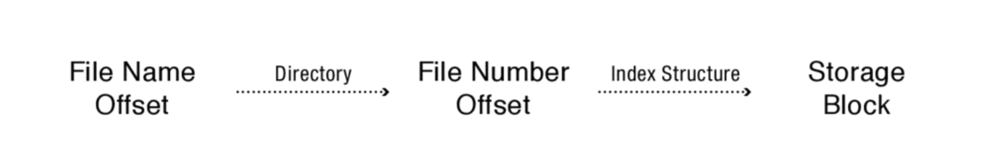

# 교재 정리

교재: Operating Systems Principles & Practice, Thomas Anderson & Michael Dahlin, 2nd Ed. Recursive Books, 2014.

### _계속 정리 중..._

v1

v2

v3
# 9.
With a high-speed local area network such as a data
center, the latency to fetch a page of data from the memory of a nearby computer is
much faster than fetching it from disk. Cooperative Caching (70p)

Local disk or non-volatile memory. For client machines, local disk or non-volatile
flash memory can serve as backing store when the system runs out of memory. In
turn, the local disk serves as a cache for remote disk storage. For example, web
browsers store recently fetched web pages in the client file system to avoid the cost of
transferring the data again the next time it is used; once cached, the browser only
needs to validate with the server whether the page has changed before rendering the
web page for the user.
Q. 어떻게 serverside 에 페이지가 바뀐 적이 있는지 validate하나? HTTP 전송 한 번 하고 들어오는 헤더에서 retently-updated 같은 값을 확인함으로써?

Thrashing  
A program thrashes if the cache is too small to hold
its working set, so that most references are cache misses. Each time there is a cache miss, we need to evict
a cache block to make room for the new reference. However, the new cache block may in turn be evicted
before it is reused.
The word “thrash” dates from the 1960’s, when disk drives were as large as washing machines. If a
program’s working set did not fit in memory, the system would need to shuffle memory pages back and forth
to disk. This burst of activity would literally make the disk drive shake violently, making it very obvious to
everyone nearby why the system was not performing well.

Fully Associative 캐시 단점  
메모리 크기는 계속 증가 (Moore's Law)
증가한 메모리 크기에 맞춰 캐시 라인 크기를 늘리든, 엔트리 개수를 늘리든 해야 함
1. 라인 크기를 늘림 
    - 프로그램의 spatial locality 한계가 있어서 큰 라인을 가져오더라도 활용할 가능성 낮음
    - 멀티프로세서에서 다른 프로세스가 해당 캐시 라인을 invalidate 할 가능성 높아짐 (false sharing)
2. 캐시 엔트리 개수를 늘림
    - Fully Associative의 동시 병렬 검색을 위해서 필요한 Comparator가 증가된 엔트리 수만큼 더 필요함 

File I/O by two methods  
1. Using system calls read/write
- 디스크에 있는 파일은 유지한 채로 적절한 자료구조로 변형한 복사본을 커널 메모리에 올리고, 유저 버퍼에도 올려줌
- 디스크 <-> 커널 메모리 <-> 유저 프로세스 버퍼
- read/write 시스템 콜 이용 시 커널이 개입해 유저 버퍼에 값을 올려주고, 유저 버퍼의 작성 값을 커널 메모리에 담고 있었다가 디스크로 flush
2. Memory Mapped File
- memory의 특정 공간에 파일을 매핑시켜 파일을 program segement로 다룰 수 있게 함.
    - system call이 아닌 load write 등 일반 명령어 사용해 읽고 쓰기 가능
    - copy본에 작업하는 게 아니라, 디스크에 바로 작업함
        - 메모리와 디스크를 대응시킴: mmap() 시스템 콜의 도움을 받음
        - 덕분에 메모리에 작업 -> 디스크에 적용
        - 일반적으로 write-back 으로 변경 사항이 바로 디스크에 적용되지는 않음
    - 일반적인 load, write로 실행된다는 것의 의미: 만약 파일이 메모리에 올라와있지 않다면 page fault 나고 디스크에서 로드 후 아무 일 없던 것처럼 재실행 됨
        - 프로그램을 처음 시작할 때도 적용됨: executable을 메모리에 올릴 때 모든 파일들을 올릴 필요 없이 필요한 첫 페이지만 올려서 빠르게 실행한 후 뒤에 필요한 페이지들은 그때그때 페이지 폴트를 통해 로드함 


주기적으로 추방 가능성이 높은 Dirty 페이지를 백그라운드에서 디스크에 복사함으로써 Clean으로 만든다 (p91)
- 나중에 필요할 때 해당 dirty 페이지가 추방된다면 dirty이므로 디스크에 변경 사항을 적용해야 하고, 재개까지 시간이 오래 걸림
- 그래서 미리 추방 가능성이 높은 페이지를 찾고, 이게 dirty라면 디스크로 동기화 해 줌으로써 clean 상태로 만들고, 나중에 필요 시 디스크 I/O 없이 바로 페이지 갈아끼울 수 있음


페이지가 수정되어 디스크에 쓰여질 때 페이지 테이블의 dirty bit를 초기화한다. 이 때 그 가상주소에 해당하는 TLB 엔트리를 삭제(shootdown)한다. 왜?
- TLB도 엔트리 별 dirty bit을 관리하고 있기 때문이다.
    - 그럼 페이지 테이블에서처럼 dirty bit만 초기화하면 되지 않나? 왜 엔트리 전체를 삭제하는거지? 비효율적인데?
    - TLB는 크기가 작고 극히 일부분의 명령만 수행할 수 있기에 엔트리 안에 있는 특정 위치(dirty bit)를 조작할 수 없다. 따라서 dirty bit을 초기화 시키기 위해 엔트리 삭제를 할 수밖에 없다. 물론 dirty bit만 조작할 수 있다면 효율적이다.


Swapping
- 돌아가고 있는 프로세스들의 메모리 요구량 총계를 메모리가 감당하지 못할 때 특정 프로세스가 차지하는 모든 메모리 페이지를 disk로 flushing 해 다른 프로세스에 나눠줌으로써 메모리 요구를 맞춰주는 방식
- 만약 그대로 놔둔다면?
    - 메모리가 부족하기 때문에 프로세스의 메모리 요구를 맞추기 위해 다른 프로세스가 active하게 사용 중인 메모리 페이지를 disk로 flush해야 한다. 이 과정이 계속 반복되면서 throughput 극도로 낮아지는 문제 발생함.


# 10. Advanced Memory Management
## Zero-Copy I/O. How do we improve the performance of transferring blocks of data
between user-level programs and hardware devices? 


## Virtual Machines. How do we execute an operating system on top of another
operating system, and how can we use that abstraction to introduce new operating
system services?  
- shadow page table: Host OS가 Guest User Process의 가상 메모리 -> Host 물리 메모리를 매핑해주는 페이지 테이블 
    - Guest User Program 가상 메모리 <-> Host 물리 메모리 매핑
    - 호스트 입장에서 똑같은 유저 프로세스인 Guest OS와 Guest User Program을 구분하기 위해 사용함. 구분하지 않는다면 Guest User 프로세스가 Guest Kernel 메모리 영역을 수정하려할 때 호스트 입장에서는 똑같은 유저 프로세스 메모리 영역이므로 정상이라 판단할 수 있게 되고, 게스트 프로그램이 게스트 커널 장악 가능.
    1. Guest Page Table (Guest OS가 관리)
        - Guest 가상 주소 -> Guest 물리 주소
        - Guest OS가 자유롭게 수정
        - 실제 사용은 안 됨 (참조용)

    2. Shadow Page Table (VMM이 관리)
        - Guest 가상 주소 -> Host 물리 주소
        - Guest OS의 page table 변경 추적
        - 권한도 올바르게 복사
        - CPU가 실제로 사용

- Multiple copies of the same page: 같은 내용의 페이지를 여러 개 두지 말고, 메모리 상에서 "단 하나"만 둔 채, 이를 사용할 예정의 페이지들이 해당 단 하나의 페이지를 참조하게 하고, write 가 일어날 때에야 새로운 공간에 작성함으로써 공간을 줄이는 방법
- Compression of unused pages: 비슷한 내용을 가진 페이지들을 압축해서 메모리 사용량을 줄이는 방법. 비슷한 내용의 페이지가 두 개(A, B) 있을 때, 압축할 페이지(B)에서 원본 페이지(A)와 다른 부분을 빼내고 이 부분(B')만 따로 저장한다. 이후에 압축된 페이지가 참조될 때 원본 페이지(A)와 압축된 부분(B')을 사용해서 압축한 페이지(B)를 복원해서 사용한다.
    - 이 방법이 효과적인 이유는 디스크로 내려가지 않고 메모리에서 압축 및 복원 작업을 수행하기 때문임. 메모리 공간이 부족해서 B 페이지가 디스크로 내려갔다면 B를 나중에 읽을 때 Disk I/O를 수행해야 하기 떄문


## Fault Tolerance. How can we make applications resilient to machine crashes?
### Checkpoint and restart
프로세스의 메모리 상태를 일정 주기로 디스크에 저장하고 나중에 불러올 수 있게 한다. 어떻게?
- 메모리 통째로 디스크에 복사: 경합 문제 때문에 복사 시간동안 메모리 변경 막기 위해 프로세스 진행을 블락해야 됨. 느리고 쌉손해
- Copy-On-Write로 경합 문제를 없앤다면? 메모리 페이지들을 Read-only로 변경하고 복사를 프로세스 진행과 병렬적으로 수행시킨다. 프로세스가 Read-only 페이지를 변경할 때 COW하면 안전하게 프로세스 상태 저장 가능. 그래도 메모리 자체를 복사하는 것이므로 느리다.
- 메모리 자체를 복사하지 않고 diff만 남길 수는 없나? 메모리 변경 명령어들만을 저장한다면 메모리를 통째로 복사하는 것보다 시간이 적게 걸릴 수 있다. 불러올 때는 저장한 명령어들을 순차적으로 실행하면 된다. 다만 이렇게 되면 매 메모리 write 마다 커널 트랩을 발생(컨텍스트 스위치)시켜야 하고 디스크에 작성(이건 백그라운드에서 가능하긴 할듯)해야 하기 때문에 엄청 느려질 수 있다. 프로세스 진행 상한이 프로세서의 속도가 아니라 트랩 핸들러의 속도에 막힌다. 또한 순차적으로 로그를 쌓는 형태이므로 삭제한 예전 내용을 보존하는 문제도 있을 수 있다.
    > So if you write a memo insulting your boss, and then edit it to tone it down, it is best to save a completely new version of your file
before you send it off!
- 명령어 단위가 아니라 좀 더 큰 단위로 가자. 페이지 단위로 변경 사항을 저장하자. 모든 페이지를 read-only 로 변경한다. write 시 트랩 발생시켜 dirty bit을 세팅한다. 이후 이 페이지의 write는 트랩 없이 쭉 진행 가능하다. 체크포인팅 시 dirty bit이 켜져있는 페이지들만 디스크로 복사한다. 이렇게 되면 전체 페이지 복사할 필요 없고 write마다 트랩이 발생하지도 않는다. 


## Security. How can we contain malicious applications that can exploit unknown faults inside the operating system? 
내 운영체제와 같은 환경의 가상 머신에서 앱을 다운받고 돌린다. 
> And of course, reinstalling your system after it has become infected with a virus is even slower!
회사 차원에서 대규모로 돌리는 것을 virtual machine honeypot 이라고 한다. 
한계로는 
- 바로 시스템을 탈취하려 드는 바이러스의 경우 쉽게 알 수 있지만, 가만히 잠복해있는 경우 이게 바이러스인지 아닌지 판단이 어렵다. 
- 가상머신뿐만 아니라 더 나아가 호스트로 탈출해서 호스트 머신까지 감염시키는 바이러스가 있다면 큰일날 것이다. 찾아보니 실제로 그런 경우가 꽤 되는 것 같다. [Virtual Machine Escape](https://en.wikipedia.org/wiki/Virtual_machine_escape)


## User-Level Memory Management. How do we give applications control over how
their memory is managed? 
DB, Garbage Collector, Sandbox 등 많은 어플리케이션들은 메모리 기대치에 따라 작동을 다르게 한다. 이 기대치와 page evict, allocation 등 운영체제가 제공하는 메모리 관리 정책과 괴리가 생기면 불필요한 페이징, thrashing 등 문제가 생긴다. 이를 해결하기 위해,
- Pinned page: 어플리케이션에서 특정 가상 페이지를 물리 페이지에 고정시켜 운영체제가 evict하지 못하게 한다.
- User-level pagers: 커널이 페이지 폴트를 핸들링하지 않고 유저 어플리케이션에서 정의된 페이지 폴트 핸들러에게 처리를 위임한다. 어플리케이션을 잘 알고 있는 유저 핸들러가 어떤 페이지를 evict하고 불러올지 결정한다. 


# v4 Persistent Storage

## File Systems: Introduction and Overview
disk와 같은 non-volatile storage는 random access가 안 됨. bulk로 가져와야 함. 물리적으로 모터를 움직여야 함. 디스크 random access 시간(=10ms) >>> DRAM 시간(=100ns)
지속되어야 하는 데이터는 disk에 넣어야 하는데 사용자가 다루기 쉬운 구조, 디스크 접근을 최소화 한 운영체제의 기능이 파일 시스템임 

File: 이름붙여진 데이터들의 집합. 걍 임의의 길이의 바이트 배열임. 
- 무작위 바이트 배열이라면 어떻게 OS가 파일을 실행할 수 있지? 
두 가지로 나뉜다. binary file 혹은 script file
- binary file이면 파일을 파싱해서 code, data 섹션들 메모리로 로드하고 시작한다. 
- script file이면 그 스크립트를 실행할 interpreter을 불러와서 얘한테 맡겨야 한다. 
어떻게 OS가 구분하지?
- 리눅스 기준 ELF 바이너리는 0x7f, 0x45, 0x4c와 0x46로 시작한다. 
- 스크립트 파일은 #! 로 시작한다. ex) #! bin/sh
- .exe, .pl 등 확장자로 구분할 수도 있다.

Directory: 파일에 이름을 부여해주는 것. 파일과 다르게 바이트를 저장하지 않음. 디렉토리는 파일을 가질수도 디렉토리를 가질수도 있음 -> 계층

Volumn: 파일과 디렉토리가 저장된 논리적 디스크 ex) USB 내에 있는 파일 시스템. 논리적 구조 덕분에 한 volumn을 volumn에 붙일 수 있다. 이를 마운트(mount)라 한다. USB를 컴퓨터에 연결하면 USB 볼륨이 컴퓨터 볼륨에 마운트되어 컴퓨터 볼륨에서 USB에 저장된 내부 파일을 보거나 수정할 수 있다.


11.2 API
11.3 Software Layers
11.3.1 API and Performance
file system API and also provide caching and write buffering 제공
- Block cache: Disk의 파일 내용 많이 버퍼에 가져와 캐시 -> 작은 요청 여러 번 하더라도 syscall or Disk IO 발생하지 않음. 다른 프로세스들 간 동기화 되어야 함.
- Prefetching: 해서 나중에 쓸 것으로 보이는 디스크 블록들도 메모리에 미리 가져옴

11.3.2 Device Drivers: Common Abstractions
OS와 하드웨어 I/O 사이를 이어줌. OS가 하드웨어를 몰라도 같은 명령으로 동일한 기능을 할 수 있게 하드웨어를 추상화 해 줌. 그래서 하드웨어 제작사가 해당 하드웨어를 위한 Device Driver도 만드는게 보통임. 
_Challenge: device driver reliability_
커널 루틴이 의존하고, 하드웨어와 상호작용 해야하기 때문에, 디바이스 드라이버는 운영체제의 일부로써 실행된다. 따라서 드라이버가 결함이 있다면 운영체제에까지 악영향을 미칠 수 있게 된다. 따라서 어렵겠지만 드라이버도 유저 프로세스들처럼 false isolation을 잘 시켜서 실행해야 한다. 

11.3.3 Device Access
하드웨어는 메모리와 구조부터 다르다. byte addressable도 아니다. 어떻게 디바이스 드라이버는 하드웨어에 엑세스하고 CPU, 메모리와 소통할 수 있을까? 세 가지 방법 덕분에 가능하다. 
### Memory-mapped I/O.
<p align="center">
    
</p>
디바이스 드라이버는 위 사진처럼 I/O Bus와 Memory Bus 두 버스와 연결되어있다. 그래서 하드웨어에서 버스 트래픽이 발생하면 그에 맞는 디바이스 드라이버가 작업을 해서 메모리 버스에 신호를 보내주는 식이다. 
그렇다면 어떻게 CPU는 하드웨어 신호를 인지할 수 있을까?
물리 메모리의 특정 영역을 디바이스 드라이버에게 각각 할당한다. 해당 주소로의 Read/Write 명령은 메인 메모리로 가지 않고 디바이스 컨트롤러의 레지스터로 간다. 이렇게 CPU와 드라이버가 소통할 수 있다.
```asm
MOV register, memAddr // To read
MOV memAddr, register // To write
```

### DMA
CPU 개입 없이 하드웨어와 메모리 간 데이터를 주고받는 방식
1. CPU가 memory mapped I/O를 통해 장치의 DMA 레지스터에 어떤 데이터를 어디로, 얼마나 보낼 지 설정한다
2. 장치가 자신의 DMA 엔진을 통해 메모리 버스를 사용해 데이터를 메모리로 직접 전송한다
3. 완료 시 인터럽트를 발생시켜 CPU에게 알린다

### Interrupts
I/O 디바이스의 DMA가 끝났을 떄 인터럽트로 완료를 알린다. 다른 옵션으로는 CPU가 memory mapped된 영역을 계속 read하는 Polling 방식이 있는데, 디바이스 접근은 느릴 뿐더러 완료 시점이 불규칙하기 때문에 인터럽트를 주로 쓴다.

11.3.4 Putting It All Together: A Simple Disk Request
유저 프로세스가 `read()` 시스템 콜을 호출했을 때 어떻게 실행되는지 생각해보자.
1. 커널은 호출한 스레드를 wait 큐에 넣고 block 시킨다.
2. 커널은 MMIO(Memory Mapped I/O)를 이용해 아래 정보를 디스크에 보낸다.
    - 필요한 데이터 정보(위치, 크기)
    - 어느 영역으로 보낼 지(DMA 세팅)
3. 디스크가 데이터를 읽고 DMA로 메모리에 값을 복사해 넣는다.
4. 디스크는 인터럽트를 발생시킨다.
5. 커널의 인터럽트 핸들러는 복사된 데이터가 있는 커널 버퍼의 데이터를 유저 버퍼로 복사한다.
6. 커널의 인터럽트 핸들러는 1번에서 block 시켰던 스레드를 ready로 변경하고 종료한다.
7. 스레드가 스케줄링 되었을 때 준비된 데이터를 사용할 수 있다.

11.4 Summary and Future Directions
Exercises


12 Storage Devices
디스크는 DRAM과 다르게 랜덤 엑세스 시간이 엄청 느리고 한 번에 몇 천 바이트를 읽어온다. 같은 디렉토리 안에 있는 파일들을 인접한 섹터에 보관해놓으면 sequential reading이 되기에 파일 시스템 디자인 시 디스크의 특징을 잘 알아야 함. 

12.1 Magnetic Disk
디스크의 최소 저장 단위는 섹터(Sector)다. 이는 보통 512B로 한 번의 읽기/쓰기 단위가 512B로 일어난다. 한 바이트를 변경하고 싶어도 500배의 공간에 접근해야 한다.
왜 더 줄이지 못하는가?
- 하드웨어는 섹터 별로 자체 에러 수정 코드(Error Collection Code)를 관리하는데, 단위가 작아지만 ECC 오버헤드가 커지기 때문

12.1.1 Disk Access and Performance
### Seek
모터 돌려서 읽고자 하는 트랙으로 이동

### Rotate
트랙 안에서 원하는 섹터로 이동
최적화: 새로운 track으로 바뀌고 목표 섹터로 갈 때, 원하는 섹터 말고도 헤드가 지나가면서 접근한 섹터들의 내용도 모두 읽어서 디스크 버퍼에 기록해 놓는다. 다음에 미리 읽어놓은 부분 요청이 들어왔을 때 full-ratation 하지 않고 바로 응답할 수 있게 됨.

### Transfer 
원하는 섹터에서 rotating 하면서 read/write 함. Seek, Rotate 시간보다 짧음. 
디스크 <-> 디스크의 버퍼 메모리 <-> 호스트의 메모리
디스크의 바깥쪽 트랙은 안쪽 트랙보다 면적이 넓으므로 바깥쪽 트랙의 transfer rate가 안쪽보다 더 크다. 그래서 transfer rate를 보면 하나의 값이 아닌 50~128 MB/s 처럼 범위로 되어있는 것이다.
Random이 아니라 순차적 읽기를 하면 Seek, Rotation은 더 할 필요없이 Transfer 만 여러 번 하면 되기 때문에 비용이 급격히 낮아진다.

12.1.2 Case Study: Toshiba MK3254GSY


12.1.3 Disk Scheduling
inner disk <-> outer disk 간 딜레이, rotation time 등으로 디스크에 들어오는 read/write 요청들을 out of order로 스케줄링 하는게 의미가 생김
12.2 Flash Storage
12.3 Summary and Future Directions
Exercises

13 Files and Directories
파일 이름과 디스크에 저장된 block의 offset 만으로 어떻게 메타데이터와 내용을 가진 계층적인 파일 시스템을 만들 수 있을까?
그러면서도 spatical locality를 잘 성취해야 하고, 다양한 명령에 범용적으로 기능해야 하며, OS나 하드웨어가 크래시 되어도 정보는 잘 저장되어야 한다.

13.1 Implementation Overview
파일 이름과 block offset 을 physical storage block에 매핑한다.
directories, index structures, free space maps, and locality heuristics 네 가지 테크닉을 사용한다.

<p align="center">
    
</p>

directories와 index structures는 file name을 물리 디스크 블락으로 매핑시켜주는 데 사용된다.
free space maps는 효율적인 공간 활용을 위해 빈 공간 정보를 추적한다. 
다양한 locality heuristics 하에서 위 요소들이 구현될 수 있다.

13.2 Directories: Naming Data
디렉토리는 `파일 이름 -> 파일 값` 매핑 정보들을 가지는 파일이다.
원래는 단순 링크드 리스트로 관리했는데 파일 개수가 많아지면 링크드 리스트의 조회가 비효율적이게 되어 B+ 트리 구조를 채택하게 됨.

hard link: Leaf 노드의 포인터 값을 기존에 있는 파일의 값으로 설정하면 됨
soft link: 참조하고자 하는 파일 이름으로 대체
아래 예시 디렉토리 안에 있는 파일 세 개는 모두 같은 파일을 가리킴.
foo.txt, bar.txt는 hard link, baz.txt는 soft link 되어있음
foo.txt를 unlink해도 bar.txt에서 원본 파일에 접근 가능하지만 foo.txt를 softlinking 하는 baz.txt에서는 접근 오류가 남
```
foo.txt 871 
bar.txt 871
baz.txt foo.txt 
``` 

13.3 Files: Finding Data
Tree index는 Linked List 보다 Random access가 좋음
13.3.1 FAT: Linked List
File Allocation Table dictionary 사용해 다음 파일 블럭 값 갖게 함. 
남는 공간은 FAT의 zerod entry sequential search 하면서 얻음(next fit). 간단, but fragmentation 확률 높음

13.3.2 FFS: Fixed Tree
Unix Fast File System
inode 리스트 안에 파일 별 inode element 가짐. 파일 메타데이터, 각 물리 파일 블럭의 포인터를 가짐. 크기를 고려해 direct, indirect, double, triple indirect block pointers 를 가짐. 수 TB의 파일 지원 가능. 
이 엔트리들은 inode 파일 안에 모두 sequential하게 위치에 있어 disk에서 정보를 읽어들일 때 transfer만 하면 되므로 순차 탐색 가능, 탐색 시간 줄어듦. 
Q. inode 파일이 12 direct, 1 indirect, 1 double indirect, 1 triple indirect, and 1 quadruple indirect pointers로 구성된다면 이 인덱스 구조가 지원하는 최대 파일 용량은? Assuming 4 KB blocks and 8-byte pointers.
A. direct는 4KB => 12*4KB = 3 * 2^14B
파일 페이지 하나가 가질 수 있는 포인터 개수 = 2^12/2^3 = 2^9개
indirect = 2^9 * 4KB = 2^21 B
double indirect = 2^9 * 2^9 * 4KB = 2^30 B
triple = 2^(9*3) * 4KB = 2^39 B = 0.5 TB
quadrruple = 2^(9*4) * 4KB = 2^48 B = 256 TB
In total, ~= 256.5 TB

13.3.3 NTFS: Flexible Tree With Extents
디스크 전체의 비트맵을 메모리에 유지하는 것은 공간 상 비현실적이다. 탐색 비용도 큼
13.3.4 Copy-On-Write File Systems
13.4 Putting It All Together: File and Directory Access
13.5 Summary and Future Directions
Exercises


14 Reliable Storage
14.1 Transactions: Atomic Updates
14.1.1 Ad Hoc Approaches
14.1.2 The Transaction Abstraction
14.1.3 Implementing Transactions
14.1.4 Transactions and File Systems
14.2 Error Detection and Correction
14.2.1 Storage Device Failures and Mitigation
14.2.2 RAID: Multi-Disk Redundancy for Error Correction
14.2.3 Software Integrity Checks