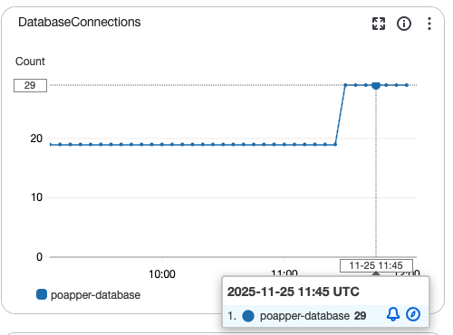
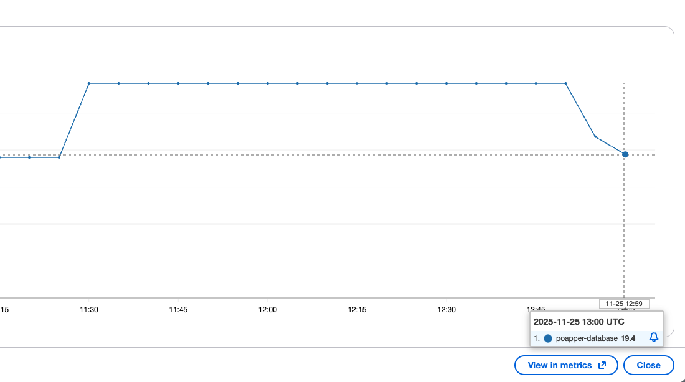

# Too many connections

RDS 작업을 하려고 접속했는데 커넥션이 많다며 팅겼다.

```bash
% mysql -h ~대충 접속~
Enter password: 
ERROR 1040 (08004): Too many connections
```

<p align="center">
    
</p>

모니터링을 보니 커넥션 수가 20 언저리에서 29까지 올라간 뒤 더 이상 늘어나지 않고 있었다. DB 인스턴스의 최대 커넥션 한계에 도달해 새로운 연결이 차단된 것으로 보인다.

## 문제의 원인

DB 인스턴스에 연결할 수 없는 원인을 두 가지로 추정했다.

### 1. RDS Parameter Group의 max_connections 설정

RDS의 parameter group에 설정된 `max_connections` 값은 `LEAST({DBInstanceClassMemory/25165760},12000)` 공식으로 계산된다. 현재 사용 중인 `db.t3.micro` 인스턴스의 메모리는 1GiB(=1,073,741,824B)이므로, 이를 25165760B로 나누면 약 **42**가 나온다.

흠.. 42개면 29개보다 많을텐데 뭔가 내가 모르게 DB 인스턴스에서 예약해 사용하는 커넥션들이 있을 수도 있겠다. _<- 아니었다_

### 2. DB 인스턴스 자체의 max_connections 설정

Parameter group의 계산식과는 별개로, DB 인스턴스 자체에 설정된 `max_connections` 값이 더 낮을 가능성도 있다. 하지만 현재는 DB에 접속할 수 없어 직접 확인할 방법이 없었다.

> **후일담**: 나중에 확인해보니 실제로 DB 인스턴스의 `max_connections`가 **30**으로 설정되어 있었다. 결국 AWS Parameter Group의 계산값(42)보다 DB 인스턴스 자체 설정(30)이 병목이었던 것이다.

## 해결 전략

작업을 진행하려면 DB 인스턴스에 접속해야 하는데, 커넥션 한계로 막혀있는 상황이다. 두 가지 방법을 고려했다.

### 1. 최대 커넥션 수 늘리기

RDS Parameter Group의 `max_connections` 계산식을 수동으로 수정해 상한을 늘리는 방법이다. 하지만 다음 이유로 보류했다:

- 정확한 계산값을 확신할 수 없음
- DB 인스턴스의 가용 메모리가 100~200MB 정도로 여유가 많지 않아 커넥션 수를 늘리면 메모리 부족 위험이 있음
- Parameter Group 변경 사항이 즉시 적용될지 불확실함

### 2. 기존 커넥션 줄이기 (선택)

AWS 설정을 직접 건드리지 않고 애플리케이션 레벨에서 커넥션 사용량을 줄이는 방법을 선택했다.

## 커넥션이 많아진 이유

먼저 왜 커넥션이 이렇게 많이 생겼는지 파악해야 한다.

### TypeORM의 커넥션 풀 동작 방식

백엔드 서버가 시작될 때 TypeORM은 매번 쿼리마다 커넥션을 새로 만드는 오버헤드를 줄이기 위해, DB 인스턴스에 미리 여러 개의 커넥션을 맺어두는 커넥션 풀을 생성한다.

TypeORM의 기본 커넥션 풀 크기는 일반적으로 **최대 10개**로 기본 설정되어 있다. 상황에 따라 동적으로 조절되면서 최대 10개까지 DB와 커넥션을 생성할 수 있다.

### 우리 서비스의 구조

현재 동아리 DB 인스턴스를 사용하는 백엔드 서버는 [popo-nest-api](https://github.com/PoApper/popo-nest-api) 와 [paxi-popo-nest-api](https://github.com/PoApper/paxi-popo-nest-api) 두 개가 있다.

각 서버는 dev/prod 두 개의 스테이지를 운영하고 있으므로, **총 4개의 서버 인스턴스**가 DB에 연결되어 있다.

TypeORM 기본 설정 상, 각 서버가 최대 10개의 커넥션을 맺을 수 있다. 따라서 총 4개 서버 × 10개 = **최대 40개의 커넥션**이 생성될 수 있다. 하지만 DB 인스턴스의 `max_connections`가 30이므로 이 지점에서 막힌 것으로 보인다.

## 해결 과정

### Dev 환경의 커넥션 제한

서버 네 개에서 차지하는 커넥션 수를 줄여야 한다. Dev 서버는 실제 사용 빈도가 매우 낮으므로, dev 환경에서는 커넥션을 최대 하나로 제한하기로 했다.

나는 `mysql2` 드라이버를 사용한다. `extra`로 네이티브 옵션을 전달할 수 있다. 아래와 같이 TypeORM 설정에서 `extra` 옵션의 `connectionLimit`을 사용하면 커넥션 풀의 최대 크기를 제한할 수 있다.

```ts
...
extra: {
    connectionLimit: isProd ? 10 : 1,
}
```

### 적용 및 결과

두 레포지토리에 변경 사항을 적용했고, dev 환경에 적용되기를 기다렸다.
[PR1](https://github.com/PoApper/paxi-popo-nest-api/pull/157), [PR2](https://github.com/PoApper/popo-nest-api/pull/181)

<p align="center">
    
</p>

Dev 컨테이너 두 개에 적용하자 커넥션 수가 **29개에서 19개로 감소**했다. 각 dev 서버가 10개씩 사용하던 커넥션을 1개씩만 사용하게 되면서 약 18개의 커넥션이 해제된 것이다. 이제 DB 인스턴스에 접속할 수 있다!!!

## 후일담

### 실제 max_connections 확인

커넥션이 줄어든 후 드디어 DB 인스턴스에 접속해서 확인해보니, `max_connections`가 **30**으로 설정되어 있었다.

```
MariaDB [(none)]> SHOW VARIABLES LIKE 'max_connections';
+-----------------+-------+
| Variable_name   | Value |
+-----------------+-------+
| max_connections | 30    |
+-----------------+-------+
1 row in set (0.018 sec)
```

AWS Parameter Group의 계산식으로는 42가 나오지만, DB 인스턴스 자체에 30으로 설정되어 있어 이 값이 실제 병목이었던 것이다. 따라서 29개에서 더 이상 커넥션이 맺어지지 않았던 것이다.

### 현재 커넥션 상태

`SHOW PROCESSLIST`로 현재 활성 커넥션을 확인했다. 총 22개의 커넥션이 있었고, Dev 환경에서 두 서버 각각이 하나의 커넥션만 맺고 있는 것을 확인했다. 

흥미로운 것은 `rdsadmin`라는 커넥션이었는데, AWS RDS 관리용 커넥션이다. 처음에 커넥션 로그 그래프에서 커넥션이 29에서 막혀 있었던게 기억 나는가? 30이 아니라 29였던 이유는 이 관리 커넥션을 하나 빼고 카운트했기 때문이었다! 처음에 DBMS가 미리 빼둔 커넥션이 많아서 그랬나 싶었는데 아니었다. 단 한 개만 빼놓고 있었다.

마지막에 있는 커넥션은 해당 쿼리가 실행되었을 때 맺어진 일회성 커넥션이다.

```
MariaDB [(none)]> SHOW PROCESSLIST;
+-------+----------+---------------------+----------+---------+------+----------+------------------+----------+
| Id    | User     | Host                | db       | Command | Time | State    | Info             | Progress |
+-------+----------+---------------------+----------+---------+------+----------+------------------+----------+
| 33064 | rdsadmin | localhost           | mysql    | Sleep   |    0 |          | NULL             |    0.000 |
| 40456 | poapper  | 172.xxx.xxx.xxx:37242  | popo     | Sleep   | 1163 |          | NULL             |    0.000 |
| 40966 | poapper  | 172.xxx.xxx.xxx:50212  | popo     | Sleep   |  859 |          | NULL             |    0.000 |
| 42675 | poapper  | 172.xxx.xxx.xxx:57378  | popo     | Sleep   | 7704 |          | NULL             |    0.000 |
| 46520 | poapper  | 172.xxx.xxx.xxx:60578  | popo     | Sleep   |    0 |          | NULL             |    0.000 |
| 47485 | poapper  | 172.xxx.xxx.xxx:36238  | popo     | Sleep   | 7704 |          | NULL             |    0.000 |
| 47486 | poapper  | 172.xxx.xxx.xxx:36212  | popo     | Sleep   | 7704 |          | NULL             |    0.000 |
| 47487 | poapper  | 172.xxx.xxx.xxx:36228  | popo     | Sleep   | 7704 |          | NULL             |    0.000 |
| 49041 | poapper  | 172.xxx.xxx.xxx:38180  | popo     | Sleep   |    9 |          | NULL             |    0.000 |
| 49051 | poapper  | 172.xxx.xxx.xxx:52622  | popo     | Sleep   |   25 |          | NULL             |    0.000 |
| 49052 | poapper  | 172.xxx.xxx.xxx:52612  | popo     | Sleep   |  718 |          | NULL             |    0.000 |
| 49053 | poapper  | 172.xxx.xxx.xxx:52624  | popo     | Sleep   | 7704 |          | NULL             |    0.000 |
| 49054 | poapper  | 172.xxx.xxx.xxx:52632  | popo     | Sleep   | 7704 |          | NULL             |    0.000 |
| 49055 | poapper  | 172.xxx.xxx.xxx:52658  | popo     | Sleep   | 7704 |          | NULL             |    0.000 |
| 49056 | poapper  | 172.xxx.xxx.xxx:52642  | popo     | Sleep   | 7704 |          | NULL             |    0.000 |
| 49560 | poapper  | 172.xxx.xxx.xxx:57098  | popo     | Sleep   |  784 |          | NULL             |    0.000 |
| 49561 | poapper  | 172.xxx.xxx.xxx:57100  | popo     | Sleep   | 1163 |          | NULL             |    0.000 |
| 49562 | poapper  | 172.xxx.xxx.xxx:57114  | popo     | Sleep   |  608 |          | NULL             |    0.000 |
| 50130 | popo_dev | 172.xxx.xxx.xxx:57332  | popo_dev | Sleep   |   24 |          | NULL             |    0.000 |
| 50133 | popo_dev | 172.xxx.xxx.xxx:42646  | popo_dev | Sleep   |   25 |          | NULL             |    0.000 |
| 50143 | poapper  | 172.xxx.xxx.xxx:34448  | popo     | Sleep   |   42 |          | NULL             |    0.000 |
| 50171 | poapper  | 114.xxx.xxx.xxx:54256 | NULL     | Query   |    0 | starting | SHOW PROCESSLIST |    0.000 |
+-------+----------+---------------------+----------+---------+------+----------+------------------+----------+
22 rows in set (0.014 sec)
```

### 커넥션이 바로 줄어들 수 있었던 이유
커넥션 상방 제한을 둔 뒤 dev에 반영했을 때 바로 커넥션이 줄어들었던 이유는 기존 커넥션 풀에서 idle 상태인 커넥션은 일정 시간 뒤 자동으로 정리하기 때문이다. dev 서버는 요청이 거의 없어 대부분 idle 이기 떄문에 즉시 회수가 가능했다. 만약 풀 몇 개가 사용 중인 prod 서버였다면 커넥션이 바로 1로 줄어들지 않았을 것이다.